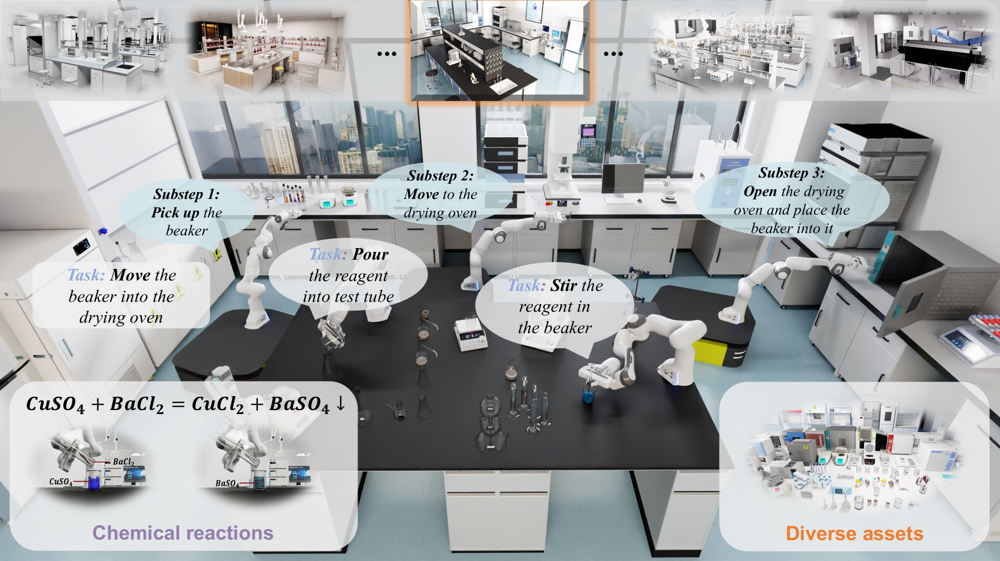

<div align="center">
  
</div>

# [NeurIPS 2025] LabUtopia: High-Fidelity Simulation and Hierarchical Benchmark for Scientific Embodied Agents

<div align="center">

[](https://arxiv.org/pdf/2505.22634v1.pdf)
[](https://arxiv.org/abs/2505.22634)
[](https://rui-li023.github.io/labutopia-site/)
[](https://huggingface.co/datasets/Ruinwalker/LabUtopia-Dataset)

</div>


<div align="center">
  
</div>


## Overview

Comprehensive Simulation Suite: LabUtopia introduces a high-fidelity simulation and benchmarking platform tailored for scientific embodied agents, integrating LabSim, LabScene, and LabBench to support complex laboratory tasks.
- **LabSim**: A high-fidelity simulator built on Isaac Sim, enhanced with a chemical engine to model reaction-driven transformations (e.g., color changes, product generation), enabling precise simulation of physical and chemical interactions.
- **LabScene**: A procedural generation pipeline that creates diverse, physically plausible 3D laboratory scenes with over 100 laboratory scenes and 100 instrument assets, verified by domain experts for realistic training environments.
- **LabBench**: A hierarchical benchmark with five levels of task complexity, spanning from atomic manipulations to long-horizon mobile manipulation tasks, covering 30 distinct tasks for rigorous evaluation of embodied agents.

## Project Timeline

- [x] **Mid-September** - Dataset Release
- [ ] **End of September** - Code Release
- [ ] **Mid-October** - Complete Tutorials and Documentation

## Citation

```bibtex
@article{li2025labutopia,
  author    = {Li, Rui and Hu, Zixuan and Qu, Wenxi and Zhang, Jinouwen and Yin, Zhenfei and Zhang, Sha and Huang, Xuantuo and Wang, Hanqing and Wang, Tai and Pang, Jiangmiao and Ouyang, Wanli and Bai, Lei and Zuo, Wangmeng and Duan, Ling-Yu and Zhou, Dongzhan and Tang, Shixiang},
  title     = {LabUtopia: High-Fidelity Simulation and Hierarchical Benchmark for Scientific Embodied Agents},
  journal   = {arXiv preprint arXiv:2505.22634},
  year      = {2025},
}
```

## License

This project is licensed under the MIT License - see the [LICENSE](LICENSE) file for details.
