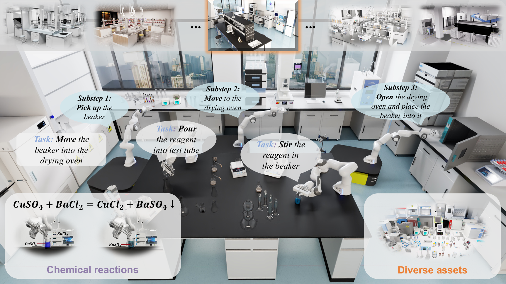

<div align="center">
  
</div>

# [NeurIPS 2025] LabUtopia: High-Fidelity Simulation and Hierarchical Benchmark for Scientific Embodied Agents

<div align="center">

[](https://arxiv.org/pdf/2505.22634v2.pdf)
[](https://arxiv.org/abs/2505.22634)
[](https://rui-li023.github.io/labutopia-site/)
[](https://huggingface.co/datasets/Ruinwalker/Labutopia-Dataset)

</div>


<div align="center">
  
</div>

[中文版 README](README_CN.md) | [English README](README.md)

## 系统要求
- 支持CUDA的RTX系列NVIDIA GPU（Isaac Sim 不支持A100/A800）
- Ubuntu 24.04（经过我们测试的系统版本）
- conda
- Python 3.11
- Isaac Sim 5.1

## 🛠️ 安装

### 1. 代码下载

下载代码并拉取场景资产

```bash
git clone https://github.com/Rui-li023/LabUtopia.git
sudo apt install git-lfs 
git lfs pull
```

### 2. 环境创建
创建并激活新的conda环境：
```bash
conda create -n labutopia python=3.11 -y
conda activate labutopia
```

### 3. 依赖安装
安装所需包：
```bash
# 安装PyTorch
pip install torch==2.9.0 torchvision==0.24.0 torchaudio==2.9.0 --index-url https://download.pytorch.org/whl/cu126

# 安装Isaac Sim
pip install isaacsim[all,extscache]==5.1.0 --extra-index-url https://pypi.nvidia.com

# 安装其他依赖
pip install -r requirements.txt

# 运行脚本设置.vscode/settings.json
python -m isaacsim --generate-vscode-settings
```

## 代码结构

```
LabUtopia/
├── main.py                  # 入口：配置 → 工厂构建 → 仿真循环
├── assets/                  # USD 场景文件
│   ├── chemistry_lab/       # 化学实验室场景资源
│   ├── navigation/          # 导航任务相关资源
│   └── robots/              # 机器人模型资源
├── config/                  # Hydra YAML 配置文件
│   ├── level1_*.yaml        # Level 1：单原子动作任务
│   ├── level2_*.yaml        # Level 2：多步组合任务
│   ├── level3_*.yaml        # Level 3：泛化性任务（OOD 材质/物体）
│   ├── level4_*.yaml        # Level 4：长序列任务
│   └── level5_*.yaml        # Level 5：移动操作任务
├── controllers/             # 任务控制器（机器人动作 + 成功判断）
│   ├── atomic_actions/      # 底层状态机控制器
│   ├── inference_engines/   # 本地 (PyTorch) / 远程 (OpenPI) 推理
│   └── robot_controllers/   # 轨迹控制器、夹爪、RMPFlow
├── data_collectors/         # HDF5 数据收集器
├── factories/               # 注册式工厂（task、controller、robot、collector）
├── packages/                # 内置 openpi-client 包
├── policy/                  # 策略训练（git 子模块：Isaac-GR00T、lerobot、lingbot-vla、openpi）
├── robots/                  # 机器人定义（Franka、Ridgebase）
├── scripts/                 # 数据转换与数据集工具
├── tasks/                   # 任务环境（场景、相机、观测）
├── tests/                   # 配置验证测试
└── utils/                   # 共享工具（ObjectUtils、相机、回放）
```

### 设计思路
1. **模块化结构** — 职责分离，便于维护
2. **Task** 负责场景状态和观测数据的获取（相机图像、机器人状态、物体状态）
3. **Controller** 负责机器人控制和任务成功条件判断
4. 三种运行模式（`collect` / `infer` / `replay`）由同一 YAML 配置驱动

## 使用方法

### 数据收集

收集训练数据是训练模型的第一步，LabUtopia 支持多种任务类型的数据收集。您也可以从我们的 [HuggingFace 仓库](https://huggingface.co/datasets/Ruinwalker/Labutopia-Dataset) 下载预收集的数据。

#### 1. 选择配置文件
在`config`文件夹中有多种预配置的任务文件：

**Level 1 基础任务：**
- `level1_pick.yaml` - 抓取任务
- `level1_place.yaml` - 放置任务  
- `level1_open_door.yaml` - 开门任务
- `level1_open_drawer.yaml` - 开抽屉任务
- `level1_close_door.yaml` - 关门任务
- `level1_close_drawer.yaml` - 关抽屉任务
- `level1_pour.yaml` - 倾倒任务
- `level1_press.yaml` - 按压任务
- `level1_shake.yaml` - 摇晃任务
- `level1_stir.yaml` - 搅拌任务

**Level 2 组合任务：**
- `level2_shake_beaker.yaml` - 摇晃烧杯
- `level2_stir_glassrod.yaml` - 玻璃棒搅拌
- `level2_pour_liquid.yaml` - 倾倒液体
- `level2_transport_beaker.yaml` - 运输烧杯
- `level2_heat_liquid.yaml` - 加热液体
- `level2_open_close.yaml` - 开关任务

**Level 3 泛化性任务：**
- `level3_pour_liquid.yaml` - 倾倒液体（OOD 泛化）
- `level3_heat_liquid.yaml` - 加热液体（OOD 泛化）
- `level3_transport_beaker.yaml` - 运输烧杯（OOD 泛化）
- `level3_open.yaml` - 开启任务（OOD 泛化）
- `level3_pick.yaml` - 抓取任务（OOD 泛化）
- `level3_press.yaml` - 按压任务（OOD 泛化）

**Level 4 长序列任务：**
- `level4_clean_beaker.yaml` - 清洗烧杯
- `level4_device_operation.yaml` - 设备操作
- `level4_open_transport_pour.yaml` - 开门、运输、倾倒
- `level4_liquid_mixing.yaml` - 液体混合

**Level 5 移动操作任务：**
- `level5_navigation.yaml` - 移动底盘导航
- `level5_mobile_manipulation.yaml` - 移动抓取放置

#### 2. 修改配置参数

每个配置文件包含以下主要参数需要根据需求调整：

```yaml
# 基本配置
name: level1_pick             # 任务名称
task_type: "pick"             # 任务类型，用于在工厂类中创建
controller_type: "pick"       # 控制器类型，用于在工厂类中创建
mode: "collect"               # 模式：collect | infer | replay

# 场景配置
usd_path: "assets/chemistry_lab/pick_task/scene.usd" 

# 任务参数
task:
  max_steps: 1000                   # 最大步数
  obj_paths:                        # 目标物体配置
    - path: "/World/conical_bottle02"
      position_range:               # 物体位置范围
        x: [0.22, 0.32]
        y: [-0.07, 0.03]
        z: [0.80, 0.80]

# 数据收集参数
max_episodes: 50                   # 最大收集轮数

# 相机配置
cameras_names: ["camera_1", "camera_2"]
cameras:
  - prim_path: "/World/Camera1"
    name: "camera_1"
    translation: [2, 0, 2]         # 相机位置
    resolution: [256, 256]         # 分辨率
    focal_length: 6                 # 焦距
    orientation: [0.61237, 0.35355, 0.35355, 0.61237]  # 方向
    image_type: "rgb"              # 图像类型：rgb、depth、pointcloud，可使用 "rgb+depth" 同时获取多种类型

# 机器人配置
robot:
  type: "franka"                  # 机器人类型，目前只支持franka
  position: [-0.4, -0, 0.71]      # 机器人位置

# 数据收集器配置
collector:
  type: "default"                  # 收集器类型
  compression: null                # 压缩设置
```

#### 3. 运行数据收集

选择配置文件后运行：
```bash
# 使用默认配置
python main.py --config-name level1_pick
```

数据将保存在 `outputs/collect/日期/时间_任务名/` 目录下。

### 训练

策略训练在 `policy/` 目录下的四个 VLA 子模块（git submodule）内部进行：

- `policy/Isaac-GR00T` — NVIDIA GR00T
- `policy/lerobot` — LeRobot（SmolVLA 等）
- `policy/lingbot-vla` — LingBot-VLA
- `policy/openpi` — OpenPI

先将采集到的数据导出为 LeRobot 格式，再按各子模块自己的 README 进行训练：

```bash
# 将一次采集导出为 LeRobot v2.1（或 v3.0）
python -m scripts.lerobot_export.cli --src <run_dir> --dst <out_dir> --version v2.1
```


### 推理

使用训练好的模型进行推理测试。

#### 1. 修改配置文件

将配置文件中的模式从 `collect` 改为 `infer`，并添加推理相关配置：

```yaml
# 基本配置
mode: "infer"                     # 改为推理模式

# 推理配置
infer:
  obs_names: {"camera_1_rgb": 'camera_1_rgb', "camera_2_rgb": 'camera_2_rgb'}
  
  # 本地推理配置
  policy_model_path: "outputs/train/2025.03.25/12.43.59_train_act_image_pick_pick_data/checkpoints/latest.ckpt"
  policy_config_path: "outputs/train/2025.03.25/12.43.59_train_act_image_pick_pick_data/.hydra/config.yaml"
  normalizer_path: "outputs/train/2025.03.25/12.43.59_train_act_image_pick_pick_data/checkpoints/normalize.ckpt"
  
  # 远程推理配置（可选）
  type: "remote"                  # 使用远程推理
  host: "101.126.156.90"         # 服务器地址
  port: 56434                     # 服务器端口
  n_obs_steps: 1                  # 观察步数
  timeout: 30                     # 超时时间
  max_retries: 3                  # 最大重试次数

max_episodes: 50                  # 推理数据集数
```

#### 2. 运行推理

```bash
# 使用本地模型推理
python main.py --config-name level1_pick

# 使用远程推理
python main.py --config-name level3_pour_liquid
```

推理结果将保存在 `outputs/infer/日期/时间_任务名/` 目录下。


## 使用OpenPI

### 安装

下载我们修改过后的OpenPI代码，并参考其`Readme`安装环境并下载预训练权重

```
git clone https://github.com/Rui-li023/openpi.git
```

### 数据转换

需要将labutopia格式的数据转换为LeRobot格式的数据，下面命令会自动在`$HF_HOME/lerobot/{repo_name}`下生成需要的lerobot格式数据集

```
python scripts/convert_labsim_data_to_lerobot.py --data_dir outputs/collect/xxx/xxx/dataset --num_processes 8 --fps 60 --repo_name labutopia/level3-pick
```

**注意：** `--fps` 参数指定转换数据的控制频率。我们收集的演示数据默认以 60Hz 采样。如果您希望转换后的数据集与原始收集行为一致，请确保将 `--fps` 设置为 60。

### 远程推理

Labutopia 支持使用openpi格式的远程服务器进行模型推理

#### 安装

```
cd packages/openpi-client
pip install -e . 
```

#### 配置
在配置文件中配置远程推理引擎：

```yaml
infer:
  engine: remote  # 使用远程推理引擎
  host: "0.0.0.0" # OpenPI服务器主机
  port: 8080      # OpenPI服务器端口（可选）
  n_obs_steps: 3  # 观察步数
```

#### 使用方法
OpenPI客户端提供简化的WebSocket与远程服务器通信：

1. **初始化**：客户端自动使用WebSocket连接到OpenPI服务器
2. **推理**：向服务器发送观察数据（图像、姿态）并接收动作预测
3. **数据格式**：自动处理图像格式转换和姿态数据序列化
4. **错误处理**：包含预测失败的回退机制

#### 服务器响应格式
OpenPI服务器应返回以下格式之一的动作：
- `{"action": [action_array]}`
- `{"actions": [action_array]}`
- 任何包含"action"键的字典

## 🤝 贡献

我们欢迎社区的贡献！如果您有任何问题、建议或改进想法，请随时：

- **提交 Issue**：报告 bug、提出功能请求或讨论想法
- **提交 Pull Request**：贡献代码改进、文档修复或新功能

在提交 PR 之前，请确保：
- 代码通过 `ruff check` 和 `ruff format --check`（配置见 `pyproject.toml`）
- 抽象方法使用 `@abstractmethod` 装饰器
- 所有公开方法有返回类型注解
- 导入按 标准库 → 第三方库 → 项目内部 分组

详细的架构说明和编码约定请参考 `CLAUDE.md`。

感谢所有贡献者对本项目的支持！🙏

## 📚 引用

```bibtex
@article{li2025labutopia,
  author    = {Li, Rui and Hu, Zixuan and Qu, Wenxi and Zhang, Jinouwen and Yin, Zhenfei and Zhang, Sha and Huang, Xuantuo and Wang, Hanqing and Wang, Tai and Pang, Jiangmiao and Ouyang, Wanli and Bai, Lei and Zuo, Wangmeng and Duan, Ling-Yu and Zhou, Dongzhan and Tang, Shixiang},
  title     = {LabUtopia: High-Fidelity Simulation and Hierarchical Benchmark for Scientific Embodied Agents},
  journal   = {arXiv preprint arXiv:2505.22634},
  year      = {2025},
}
```

## 📄 许可

本仓库包含源代码和数据资产两部分：

- **代码**
  基于 [MIT 许可证](./LICENSE) 发布。

- **数据资产**
  基于 [CC BY-NC 4.0 许可证](https://creativecommons.org/licenses/by-nc/4.0/) 发布。
  **仅限**用于研究和教育目的的使用与修改。  
